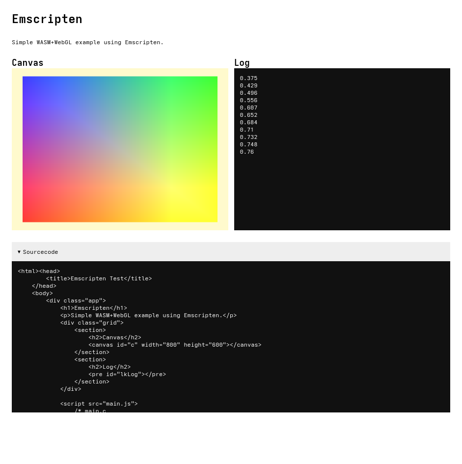

# Emscripten WASM example



[Live Demo](https://static.laszlokorte.de/wasm-test/)

Source Code is fully contained inside the HTML file to inspect.

## Build

Run `./build.sh` to generate the `.wasm` file

## Serve

WASM does not work when served from the local file system. Use a local Web-Server to proxy the HTML file:

```sh
python -m http.server
```
